<p align="center">
  
</p>

# Boxed

**The Sovereign Code Execution Engine for AI Agents. Run untrusted code safely—locally or in the cloud—using Docker, Firecracker, or Wasm.**

[](https://go.dev)
[](https://www.rust-lang.org)
[](https://www.typescriptlang.org/)
[](https://www.python.org/)
[](LICENSE)

---

## The Story 📖

Building an AI Agent that writes code? You have a problem.

*   Run it locally? 🚨 **Security Risk.** One `rm -rf /` and your laptop is gone.
*   Run it in cloud? 💸 **Expensive.** AWS instances for every user?
*   Use SaaS sandbox? 🐌 **Vendor Lock-in.** High latency and data privacy concerns.

**Meet Boxed.** The open-source, sovereign engine that gives your Agents a safe place to play. It provides a unified API to spawn ephemeral sandboxes, execute arbitrary code, and retrieve results instantly.

---

## ✨ Features

- **🔒 Pluggable isolation** — Docker driver ships today; Firecracker and Wasm drivers stubbed behind a single `Driver` interface.
- **🛡️ Bring-Your-Own-Key auth** — operator-chosen API key via `X-Boxed-API-Key`. No vendor accounts.
- **⚡ Sub-second cold start** — 303 ms median create+exec+destroy on a developer laptop (see paper).
- **📁 First-class artifacts** — in-VM Rust agent streams stdout, stderr, and emitted files (images, PDFs, datasets) over JSON-RPC.
- **🔌 Polyglot SDKs** — first-class support for TypeScript and Python.
- **🌐 Network policy** — coarse `EnableNetworking` toggle today (Docker `none` vs bridge); fine-grained egress allow-lists are on the roadmap.

> **Honest scoping:** the current Docker driver enforces a `Memory` cgroup (default 512 MiB) and runs `/tmp` and `/output` as `tmpfs`, but leaves the container rootfs writable, retains the default Linux capability set (no `CapDrop: ALL`), does not set `PidsLimit`, and permits in-PID-namespace `ptrace`. We report the full escape probe in the [paper](paper/main.pdf) and close those gaps in the planned Firecracker driver.

---

## 🚀 Getting Started

### 📋 Prerequisites

To run Boxed locally, you'll need:
- **Go 1.22+** (for the Control Plane)
- **Rust 1.75+** (for the Agent)
- **Docker Desktop** (running and accessible)
- **Standard Images**: Ensure you have a base image like `python:3.10-slim` pulled:
  ```bash
  docker pull python:3.10-slim
  ```
> [!NOTE]
> **First Run**: The first sandbox creation may take a few seconds while Docker pulls the required images. Subsequent runs are near-instant.

---

### 🏗️ Local Development

We provide a `Makefile` to simplify the build process.

```bash
# 1. Clone the repository
git clone https://github.com/akshayaggarwal99/boxed.git
cd boxed

# 2. Build everything (Agent + CLI)
make build

# 3. Start the Control Plane with Auth
export BOXED_API_KEY="super-secret-key"
./bin/boxed serve --api-key $BOXED_API_KEY

# Cleanup build artifacts
make clean
```

### 🔐 Security & Auth

Boxed uses a **Bring Your Own Key (BYOK)** model. Since you run your own instance, you define the secret key yourself at startup. 

You can set the key via the `--api-key` flag or `BOXED_API_KEY` environment variable:

All CLI commands and SDKs must provide this key:
```bash
./bin/boxed list --api-key $BOXED_API_KEY
```

---

### 💻 CLI Usage

```bash
# Run interactive REPL (Sticky Session)
./bin/boxed repl <sandbox-id> --lang python
```

---

### 🔌 SDKs

#### TypeScript
```bash
# Local install
npm install ./sdk/typescript
```

#### Python
```bash
# Local install
pip install -e ./sdk/python
```

---

### 💻 SDK Examples

#### Python
```python
from boxed_sdk import Boxed

client = Boxed(base_url="http://localhost:8080", api_key="super-secret-key")

# Create a secure session
session = client.create_session(template="python:3.10-slim")

# Run unsafe code
result = session.run("print('hello from boxed')")
print(result.stdout)

# Cleanup
session.close()
```

---

## 📚 Documentation

- **[REST API Reference](docs/api.md)** — Detailed specification of all endpoints.
- **[OpenAPI Spec](api/openapi.yaml)** — Raw OpenAPI 3.0 definition.

---

## 📄 Paper

A preprint describing Boxed's design and an open benchmark harness is available in this repo:

- **PDF:** [`paper/main.pdf`](paper/main.pdf)
- **Source:** [`paper/main.tex`](paper/main.tex)
- **Benchmark harness (reproducible):** [`bench/`](bench/)
- **Raw experiment data:** [`bench/results/*.csv`](bench/results/)

Headline numbers (MacBook Pro M1 Pro, 16 GB, macOS, Docker Desktop; n=200 cold-start trials):

| Metric                         | Value             |
|--------------------------------|-------------------|
| Median create+exec+destroy     | **303 ms**        |
| p95 / p99                      | 395 ms / 495 ms   |
| Peak throughput                | 9.8 sandboxes/s   |
| Idle agent RSS (median)        | 0.4 MiB           |
| Behavioural escape probe       | 5/12 denied       |
| HumanEval-style agent trace    | 20/20 passed      |

To reproduce:

```bash
cd bench && make all   # requires `boxed serve` running and BOXED_API_KEY set
```

### Cite

```bibtex
@misc{boxed2026,
  title  = {Boxed: A Sovereign, Polyglot Sandbox Substrate for Autonomous Code-Generating Agents},
  author = {Kumar, Akshay},
  year   = {2026},
  howpublished = {\url{https://github.com/akshayaggarwal99/boxed/blob/main/paper/main.pdf}}
}
```

---

## 🛠️ Architecture

Boxed uses a **Control Plane vs Data Plane** architecture.



*   **Control Plane (Go)**: REST API + WebSocket gateway with BYOK API-key auth (Echo, ~2.8k LOC, 12 MiB binary).
*   **Agent (Rust)**: Lightweight 1.32 MiB stripped binary injected into every sandbox; streams stdout/stderr/artifacts over JSON-RPC.

---

## 🗺️ Roadmap

- [x] **Docker driver** + Go control plane + Rust in-VM agent
- [x] **Polyglot SDKs** (TypeScript, Python)
- [x] **Sticky sessions** (REPL mode, WebSocket proxy)
- [x] **API-key auth** (Bring-Your-Own-Key)
- [ ] **Hardening** — `ReadonlyRootfs`, `CapDrop: ALL`, `PidsLimit`, tighter seccomp profile, fine-grained egress allow-lists via `iptables`
- [ ] **Firecracker driver** — MicroVMs for stronger isolation
- [ ] **Wasm driver** — sub-millisecond cold start for compatible workloads
- [ ] **Pool-based reuse** — warm sandboxes for sub-millisecond `exec` (see paper §6)
- [ ] **Multi-host scheduler**

---

## 🤝 Contributing

Contributions are welcome! Please read our [Contributing Guide](CONTRIBUTING.md).

## 📄 License

MIT License — do whatever you want with it.
